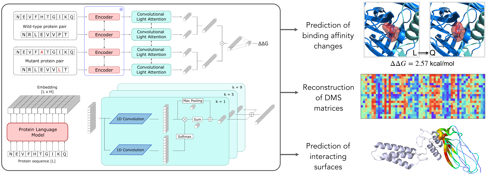

# MuLAN: Mutational effects with Light Attention Networks



MuLAN is a deep learning method that leverages transfer learning from fundational protein language models 
and light attention to predict mutational effects in protein complexes.  
Inputs to the model are only the sequences of interacting proteins and (optionally) zero-shot scores for the considered mutations. 
Attention weights extracted from the model can give insights on protein interface regions.


## Quick start

### Installation
As a prerequisite, you must have PyTorch installed to use this repository. If not, it can be installed with conda running the following:
```bash
# PyTorch 2.4.0, CUDA 12.1
conda install pytorch torchvision torchaudio pytorch-cuda=12.1 -c pytorch -c nvidia
```
For other versions or installation methods, please refer to [PyTorch documentation](https://pytorch.org/get-started/locally/).  
MuLAN and its dependencies can then be installed with
```bash
git clone https://github.com/GianLMB/mulan
cd mulan
pip install .
```
We suggest to do it in a dedicated conda environment.  
Cloning the repository will also download weights for different model versions trained on SKEMPI dataset. They are available in the folder 
`models/pretrained`. To be able to load them within the package, the environmental variable must be set:
```bash
export MULAN="path/to/mulan/folder"
```
Alternatively, if you prefer to move the checkpoint files to a different folder, you can acces them in the new location by setting the
`MULAN_MODELS_DIR` variable pointing to the corresponding folder. 


### Usage
Available mulan models and pre-trained protein language models can be easily loaded through `mulan` interface. For MuLAN models:
```python
import mulan
print(mulan.get_available_models())
model = mulan.load_pretrained("mulan-ankh")
```
For some supported PLMs, instead:
```python
import mulan
print(mulan.get_available_plms())
model = mulan.load_pretrained_plm("ankh")
```
If the corresponding PLMs are not found on disk, they will be downloaded from HuggingFace Hub and stored by default in `~/.cache/huggingface/hub` folder.

We provide several command line interfaces for quick usage of MuLAN different applications:
- `mulan-predict` for $\Delta \Delta G$ prediction of single and multiple-point mutations;
- `mulan-att` to extract residues weights, related to interface regions;
- `mulan-landscape` to produce a full mutational landscape for a given complex;
- `mulan-train` to re-train the model on a custom dataset or to run cross validation (not supported yet);
- `plm-embed` to extract embeddings from protein language models. 
Since the script uses the `transformers` interface, only models that are saved on HuggingFace 🤗 Hub can be loaded.

Information about required inputs and usage examples for each command are provided with the `--help` flag.


## Citation
If you find this useful, please cite
```bibtex
@article {Lombardi2024.08.24.609515,
	author = {Lombardi, Gianluca and Carbone, Alessandra},
	title = {MuLAN: Mutation-driven Light Attention Networks for investigating protein-protein interactions from sequences},
	year = {2024},
	doi = {10.1101/2024.08.24.609515},
	publisher = {Cold Spring Harbor Laboratory},
	URL = {https://www.biorxiv.org/content/early/2024/08/26/2024.08.24.609515},
	journal = {bioRxiv}
}
```

